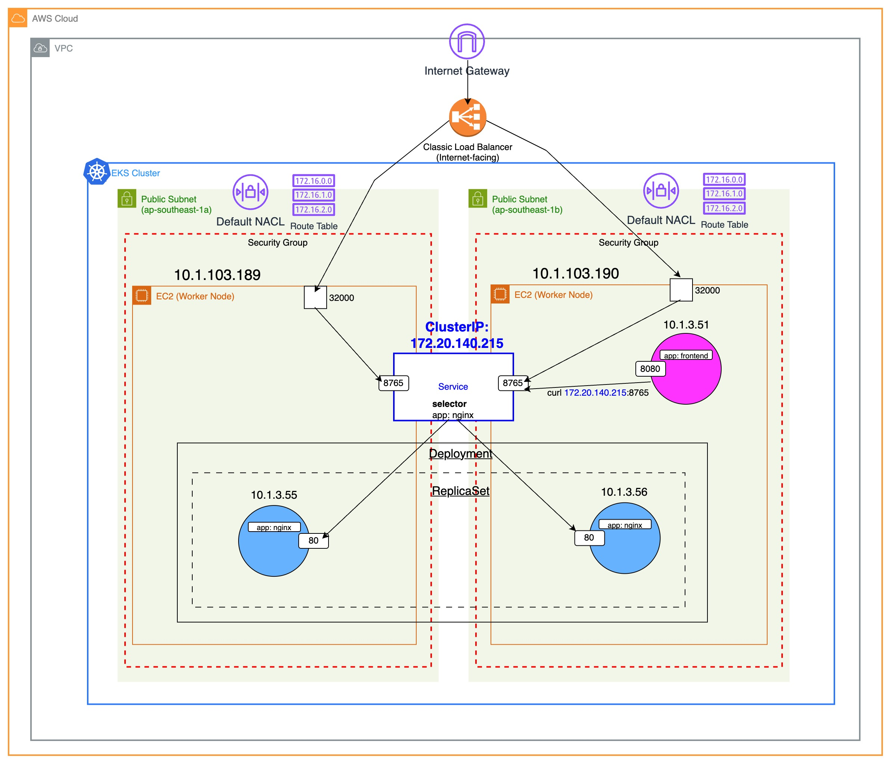

### Check out my article on "3 concepts you didn't know about the Kubernetes services resource"
https://medium.com/@kennyangjy/3-concepts-you-didnt-know-about-the-kubernetes-services-resource-e754f178da95

---

### To provision the AWS and Kubernetes resources:
1. `git clone https://github.com/Kenny-AngJY/kubernetes-service-types.git`
2. `cd terraform`
3. View the description of the variables in *variables.tf* and overwrite the default values if necessary.
4. `terraform init`
5. `terraform plan`
6. `terraform apply`  
With the default values in *variable.tf*, 47 resources will be created. As no backend is defined, the default backend will be local.
7. After creation of all resources is complete, run `aws eks update-kubeconfig --region ap-southeast-1 --name demo-service-types-eks`. Change the region if necessary.
8. As you follow along the article, you can create the relevant Kubernetes resources. e.g. To experiment with serivce of type ClusterIP, run `kubectl create -f k8s-manifest/cluster_ip_example`
9. To destroy the Kubernetes resources, `kubectl delete -f k8s-manifest/cluster_ip_example`

### Clean-up
1. `terraform destroy`